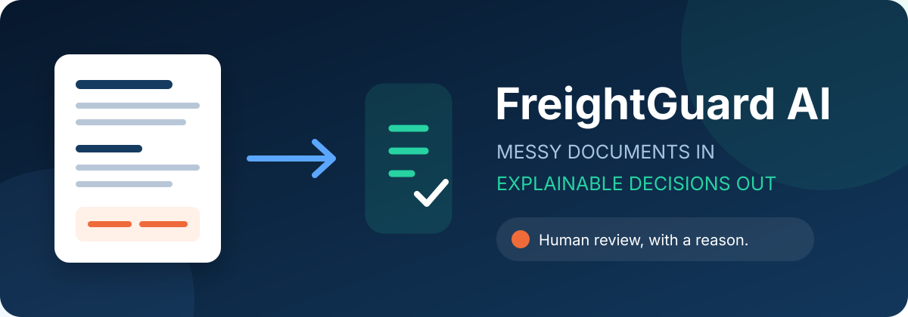
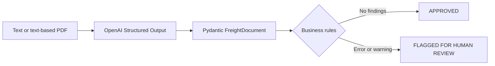

<div align="center">
  

  <p><strong>From messy freight paperwork to an explainable operational decision.</strong></p>

  <p>
    
    
    
  </p>
</div>

## The story

A freight confirmation arrives with all the familiar ingredients: inconsistent spacing, operational notes mixed with financial terms, and a total that looks plausible at a glance. The document says the linehaul is **$2,200**, fuel is **$350**, and total pay is **$2,800**. It also lists a **46,800 lb** load.

That is where FreightGuard steps in. It uses an LLM for the part language models are good at - turning irregular text into a typed record - and ordinary Python for the part that should never be left to a guess. The result is a clear decision: the total is $250 too high, the load is 1,800 lbs over the review threshold, and a person should take a look.

```text
messy document -> typed extraction -> deterministic checks -> operational decision
```

## What it returns

The supplied example produces:

```text
FLAGGED_FOR_HUMAN_REVIEW
|- RATE_MISMATCH: expected $2,550.00, reported $2,800.00
`- OVERWEIGHT_LOAD: 46,800 lbs exceeds the 45,000 lb threshold
```

The complete machine-readable result is in [`examples/sample_output.json`](examples/sample_output.json).
An actual OpenAI run against the supplied PDF is captured in
[`examples/live_terminal_output.txt`](examples/live_terminal_output.txt); credentials and local
paths have been removed from the transcript.

## How it works



The model only extracts facts. It does not fix totals, make approval decisions, or execute business rules. Those responsibilities live in separate, directly testable modules.

| Layer | Responsibility |
|---|---|
| `parser.py` | Convert source text into a `FreightDocument` |
| `models.py` | Define strict types and reject extra fields |
| `validation.py` | Run rate, weight, and completeness checks |
| `workflow.py` | Convert findings into an operational status |
| `cli.py` | Offer a small interface for documents and extracted JSON |

## Run it locally

### 1. Create an environment

```bash
python -m venv .venv
```

Activate it on macOS or Linux:

```bash
source .venv/bin/activate
```

Or on Windows PowerShell:

```powershell
.venv\Scripts\Activate.ps1
```

### 2. Install the project

```bash
python -m pip install -e ".[dev]"
```

### 3. Configure OpenAI

Copy `.env.example` to `.env`, then replace the placeholder with your key:

```dotenv
OPENAI_API_KEY=your_api_key_here
OPENAI_MODEL=gpt-4o-mini
```

Never commit `.env`; it is already ignored by Git.

### 4. Process a document

```bash
freightguard process examples/freight_confirmation.txt
```

Text-based PDFs work too:

```bash
freightguard process assets/Document.pdf
```

Scanned PDFs need OCR before this lightweight example can read them.

### 5. Run the rules without an API call

This is useful for development and for systems where extraction happens upstream:

```bash
freightguard validate examples/extracted_document.json
```

## Validation rules

- **RATE_MISMATCH / error:** linehaul plus fuel does not equal total pay, compared to the cent.
- **OVERWEIGHT_LOAD / warning:** weight exceeds 45,000 lbs.
- **INCOMPLETE_DATA / error:** carrier, load number, or any city/state/ZIP component is blank or ambiguous.

An approval means there are no findings. A warning still routes the load to human review; it should not disappear simply because it is less severe than an error.

## Architecture note

The extraction contract is defined once as a Pydantic model and passed directly to OpenAI Structured Outputs. The API response is parsed into that same model, which keeps the Python types and JSON schema from drifting apart. `extra="forbid"` rejects unexpected keys, while the prompt tells the model to preserve inconsistencies and return blank text for facts the source does not support. Refusals, connection failures, empty documents, and missing structured responses become explicit application errors rather than half-valid records.

At production scale, I would separate ingestion, extraction, validation, and downstream delivery with durable queues. PDFs would land in object storage, receive a content hash for idempotency, and move through OCR/layout extraction before LLM processing. Stateless workers could autoscale independently, while rate limits, exponential backoff, dead-letter queues, and schema-version metadata would keep failures recoverable. Repeated layouts could be routed to cheaper specialist parsers, leaving the LLM for genuinely irregular documents.

For 100,000 documents per day, throughput is only part of the problem; observability and data quality matter just as much. I would track extraction confidence proxies, field-level correction rates, rule frequency, latency, token cost, and drift by customer or document template. A review interface would capture human corrections as labeled evaluation data. Before any prompt or model change reached production, a versioned evaluation set would measure exact field accuracy and decision consistency against the current release.

## Tests

```bash
ruff check .
pytest
```

The parser tests use a fake client, so the test suite does not spend API credits. Live credentials are only needed for `freightguard process`.

## A few deliberate boundaries

- This is a focused reference implementation, not a transport-management system.
- PDF support covers documents with an extractable text layer; production ingestion should add OCR.
- The 45,000 lb threshold is a supplied business rule, not a legal weight determination.
- Model output is typed, but typed data can still be factually wrong. Human corrections and evaluation sets remain essential.

## License

Released under the [MIT License](LICENSE).
